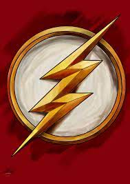

<!DOCTYPE html>
<html>
<head>
	<title>My Website Title</title>
	<link rel="stylesheet" href="style.css">
	<link rel="icon" type="image/x-icon" href="favicon.ico">
	
	
</head>
<body>
	<h1>Homepage</h1>
	<nav>
		<ul>
			<li></li>
			<li></li>
			<li></li>
			<li></li>
		</ul>
	</nav>
</body>
</html>
